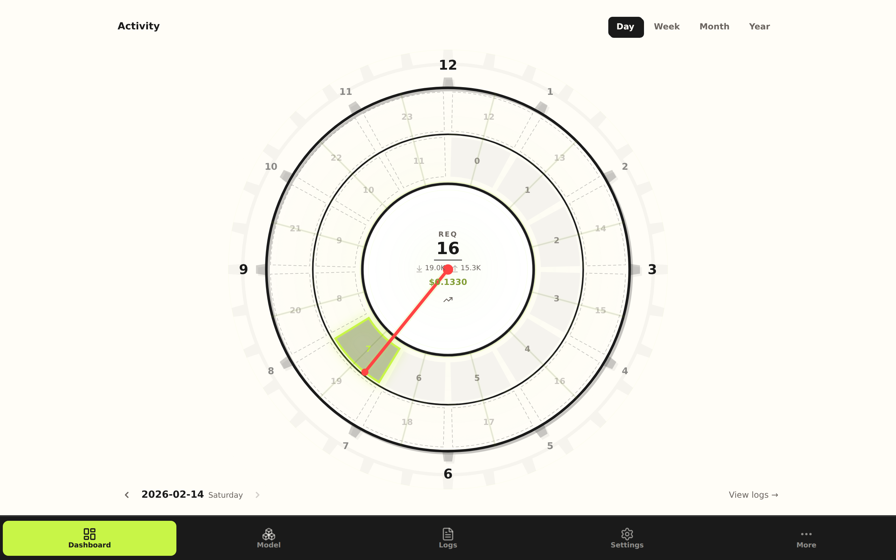
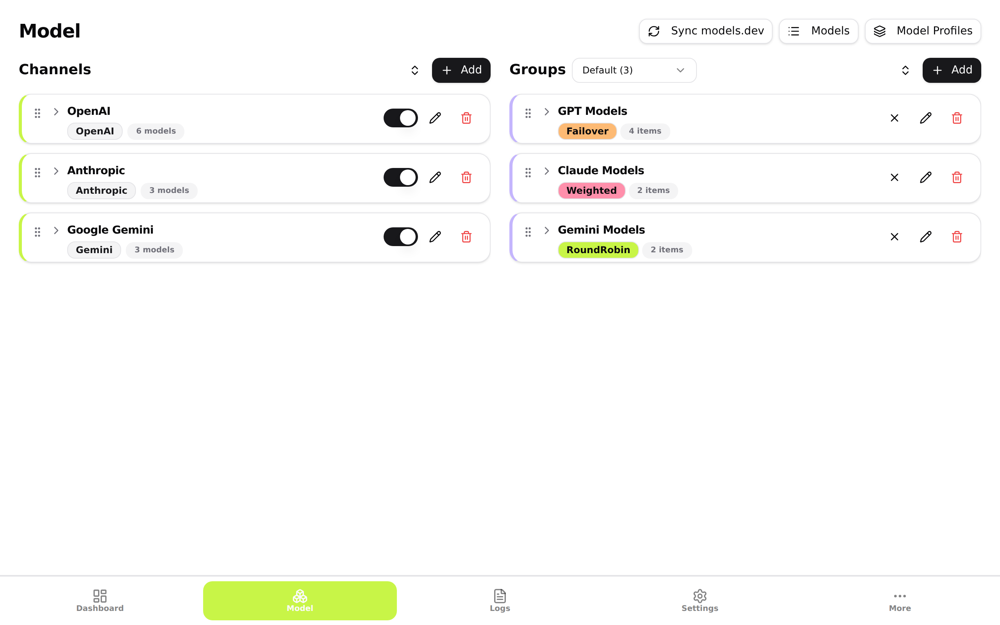
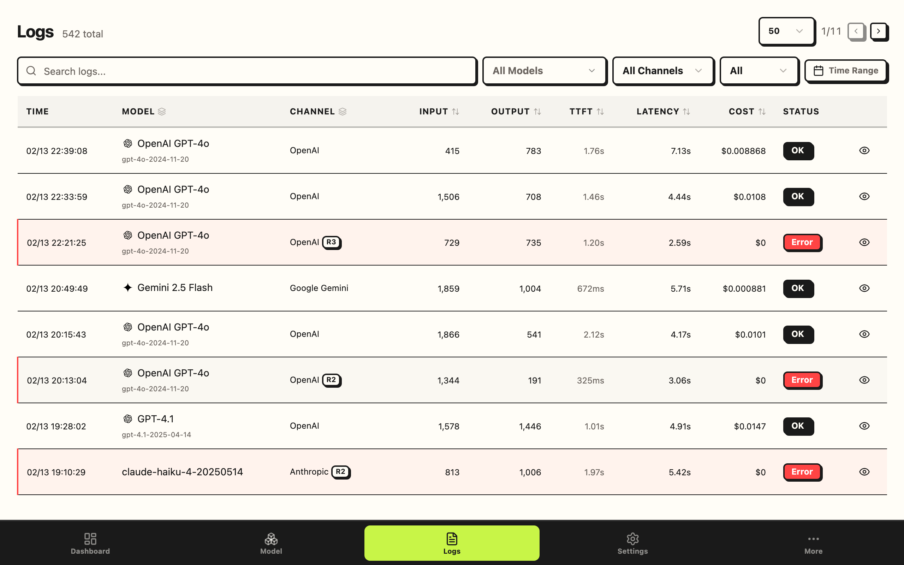
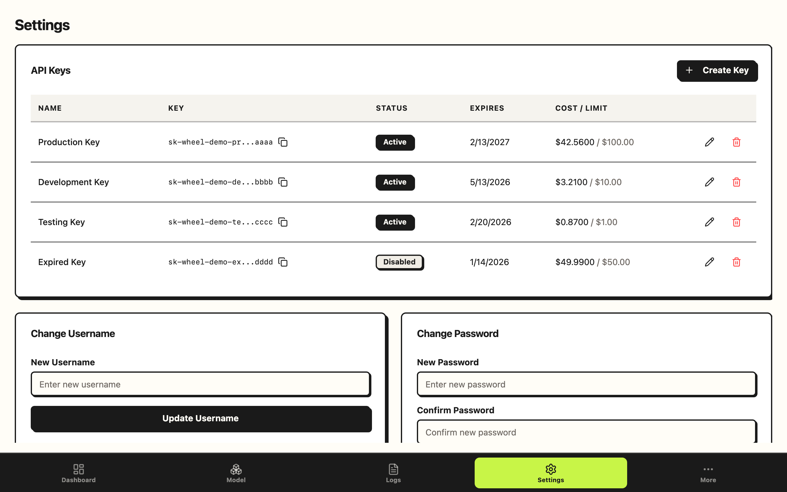

<div align="center">


# Wheel

**LLM API Gateway — Aggregate, Balance, Observe.**

统一多家 LLM 提供商接口，智能负载均衡与自动故障转移，完整的用量追踪与成本管理。

[](LICENSE)

[](https://zeabur.com/templates)

**Go · React · SQLite · Caddy**

</div>

---

<picture>
  <source media="(prefers-color-scheme: dark)" srcset="docs/screenshots/dashboard-dark.png">
  <source media="(prefers-color-scheme: light)" srcset="docs/screenshots/dashboard-light.png">
  
</picture>

<details>
<summary>更多截图 / More Screenshots</summary>

<picture>
  <source media="(prefers-color-scheme: dark)" srcset="docs/screenshots/model-dark.png">
  <source media="(prefers-color-scheme: light)" srcset="docs/screenshots/model-light.png">
  
</picture>

<picture>
  <source media="(prefers-color-scheme: dark)" srcset="docs/screenshots/groups-dark.png">
  <source media="(prefers-color-scheme: light)" srcset="docs/screenshots/groups-light.png">
  
</picture>

<picture>
  <source media="(prefers-color-scheme: dark)" srcset="docs/screenshots/logs-dark.png">
  <source media="(prefers-color-scheme: light)" srcset="docs/screenshots/logs-light.png">
  
</picture>

<picture>
  <source media="(prefers-color-scheme: dark)" srcset="docs/screenshots/settings-dark.png">
  <source media="(prefers-color-scheme: light)" srcset="docs/screenshots/settings-light.png">
  
</picture>

</details>

---

## Features

- **多提供商聚合** — OpenAI / Anthropic / Gemini 统一为 OpenAI 兼容接口，协议自动转换
- **智能路由** — 4 种负载均衡（Round Robin / Random / Failover / Weighted），3 轮重试，熔断器，会话保持
- **SSE 流式转发** — 首 token 超时检测，超时自动 failover
- **通道管理** — 多 Base URL、模型自动发现与同步、自定义请求头与参数覆盖
- **分组管理** — 通道-模型配对，优先级/权重，独立超时与会话保持配置
- **API Key 管理** — 模型白名单、用量配额、过期时间
- **成本管理** — 从 [models.dev](https://models.dev) 自动同步 9 家提供商定价，缓存 token 计费，请求级成本计算
- **实时监控** — WebSocket 仪表盘，活跃度热力图，成本趋势，通道/模型/Key 多维统计
- **请求日志** — 完整请求/响应记录，重试时间线，高级过滤，一键重放
- **数据管理** — JSON 导入/导出，图形化系统配置
- **双语 & 主题** — 中文 / English，亮色 / 暗色 / 跟随系统

---

## Deploy

### Zeabur

一键部署，点击上方按钮即可。

### Docker Compose

```yaml
volumes:
  worker-data:

services:
  worker:
    image: ghcr.io/kunish/wheel-worker
    restart: always
    environment:
      JWT_SECRET: ${JWT_SECRET:?Please set JWT_SECRET}
      ADMIN_PASSWORD: ${ADMIN_PASSWORD:-admin}
      DATA_PATH: /app/data
    volumes:
      - worker-data:/app/data

  web:
    image: ghcr.io/kunish/wheel-web
    restart: always
    depends_on:
      - worker

  caddy:
    image: caddy:2-alpine
    restart: always
    ports:
      - "3000:3000"
    volumes:
      - ./Caddyfile:/etc/caddy/Caddyfile
    depends_on:
      - worker
      - web
```

```bash
echo "JWT_SECRET=$(openssl rand -hex 32)" > .env
docker compose up -d
# 访问 http://localhost:3000
```

### 手动构建

```bash
# Worker (Go >= 1.24)
cd apps/worker && go build -o wheel ./cmd/worker && JWT_SECRET=your-secret ./wheel

# Web (Node >= 22, pnpm >= 10)
pnpm install && pnpm --filter @wheel/web build
# 静态文件服务器托管 apps/web/dist
```

---

## Usage

Wheel 兼容 OpenAI API 格式，配置好通道和分组后，将任意 AI 工具的 `base_url` 指向 Wheel 即可。

**Claude Code**

```bash
ANTHROPIC_BASE_URL=http://localhost:3000 ANTHROPIC_API_KEY=your-api-key claude
```

**opencode**

```bash
export OPENAI_BASE_URL=http://localhost:3000/v1
export OPENAI_API_KEY=your-api-key
opencode
```

**aider**

```bash
aider --openai-api-base http://localhost:3000/v1 --openai-api-key your-api-key
```

**curl**

```bash
curl http://localhost:3000/v1/chat/completions \
  -H "Authorization: Bearer your-api-key" \
  -H "Content-Type: application/json" \
  -d '{"model": "gpt-4o", "messages": [{"role": "user", "content": "Hello"}]}'
```

---

## Environment Variables

| 变量                | 组件   | 描述                              | 默认值   |
| ------------------- | ------ | --------------------------------- | -------- |
| `JWT_SECRET`        | Worker | JWT 签名密钥（必填）              | —        |
| `ADMIN_USERNAME`    | Worker | 管理员用户名                      | `admin`  |
| `ADMIN_PASSWORD`    | Worker | 管理员密码                        | `admin`  |
| `DATA_PATH`         | Worker | 数据目录路径                      | `./data` |
| `PORT`              | Worker | HTTP 端口                         | `8787`   |
| `VITE_API_BASE_URL` | Web    | Worker API 地址（独立部署时必填） | —        |

---

## Development

```bash
pnpm install
pnpm dev          # 同时启动 Worker + Web
```

---

## License

MIT
